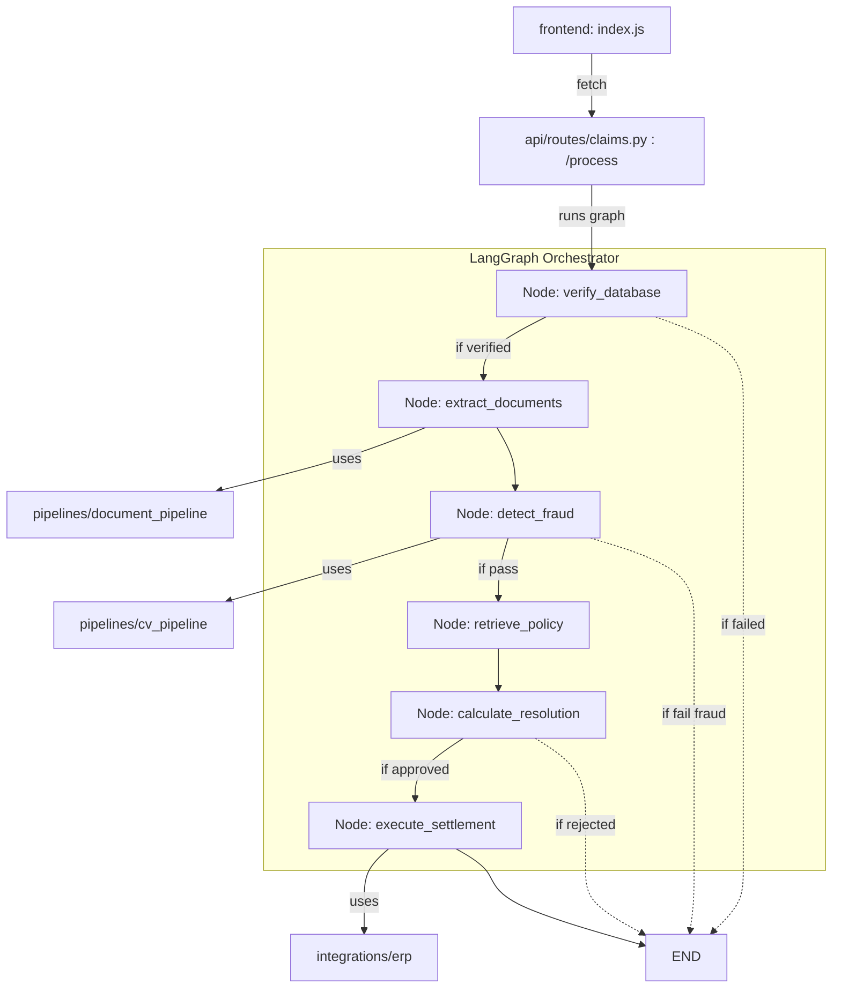

# Phase 3: PROPOSED_ARCHITECTURE

## 1. Unified Agentic Design (LangGraph State Machine)

The `AgentOrchestrator` in `backend/orchestrator/agent_orchestrator.py` will become the central nervous system for claim processing. Instead of `api/routes/claims.py` hardcoding the workflow sequentially, the route will initialize the graph, pass the incoming payload as the initial State, and let the graph's conditional edges route the execution.

### State Schema (`ClaimState`)
The state passed between nodes will be a `TypedDict` containing:
*   `claim_id`: `str`
*   `order_id`: `str`
*   `description`: `str`
*   `image_b64`: `str` (Optional)
*   `invoice_name`: `str` (Optional)
*   `db_verified`: `bool`
*   `fraud_score`: `int` (From CV Pipeline)
*   `ocr_match`: `bool` (From Document Pipeline)
*   `policy_context`: `str` (From RAG)
*   `clv_data`: `dict`
*   `final_decision`: `str` (e.g., "Auto-Resolve Approved", "Reject", "Human Review")
*   `refund_amount`: `float`
*   `messages`: `List[BaseMessage]` (For LangGraph conversational memory/logs)

## 2. Graph Nodes & Conditional Edges

1.  **Node: `verify_database`**
    *   **Calls:** `agents.evidence_verification_agent.db_lookup.DBLookupAgent`
    *   **Edge:** If `db_verified == False`, route to `END` (Reject). Else route to `extract_documents`.
2.  **Node: `extract_documents`**
    *   **Calls:** `pipelines.document_pipeline.DocumentPipeline.process_invoice`
    *   **Action:** Sets `ocr_match`.
    *   **Edge:** Unconditional to `detect_fraud`.
3.  **Node: `detect_fraud`**
    *   **Calls:** `pipelines.cv_pipeline.CVPipeline.process_image` (replaces hardcoded mock)
    *   **Action:** Sets `fraud_score`.
    *   **Edge:** If `fraud_score < 50`, route to `END` (Reject). Else route to `retrieve_policy`.
4.  **Node: `retrieve_policy`**
    *   **Calls:** `services.rag_service.RAGService.query_policies`
    *   **Action:** Sets `policy_context`.
    *   **Edge:** Unconditional to `calculate_resolution`.
5.  **Node: `calculate_resolution`**
    *   **Calls:** `clv_analyzer` and `resolution_calculator`.
    *   **Action:** Determines `final_decision` and `refund_amount`.
    *   **Edge:** If `final_decision == "Auto-Resolve Approved"`, route to `execute_settlement`. Else route to `END`.
6.  **Node: `execute_settlement`** (New Wiring)
    *   **Calls:** `integrations.erp.MockERPClient` and `integrations.shipping.MockShippingClient`.
    *   **Action:** Actually simulates the API calls to external systems that are currently orphaned.
    *   **Edge:** Unconditional to `END`.

## 3. Module Consolidation (Redundancy Check)

*   **To Become Graph Nodes:** `DBLookupAgent`, `DocumentPipeline`, `CVPipeline`, `RAGService`, `CLVAnalyzer`, `ResolutionCalculator`, `ERPClient`.
*   **To Be Removed / Flagged as Redundant:** 
    *   The raw agents in `backend/agents/cv_object_detection_agent/` and `backend/agents/anti_fraud_challenge_agent/` are too low-level and disconnected. The newly built `CVPipeline` already mocks this logic cleanly for the demo. We should flag these sub-modules for deletion unless you want to keep them as dead code for show.
    *   `backend/api/routes/integrations.py` should be deleted (DEAD-END route). Integrations should only be called by the Orchestrator, not directly by the frontend.

## 4. API Layer Refactoring

`backend/api/routes/claims.py` `process_claim` endpoint will be stripped down to:
```python
@router.post("/process", response_model=ClaimResponse)
async def process_claim(request: ClaimRequest, session: AsyncSession = Depends(get_db)):
    orchestrator = AgentOrchestrator()
    initial_state = {"order_id": request.order, "description": request.description, ...}
    
    # Graph execution
    final_state = await orchestrator.run(initial_state)
    
    # DB persistence & Analytics
    await save_to_db(final_state, session)
    
    return ClaimResponse(...)
```

## 5. Target Call Graph (Mermaid)


